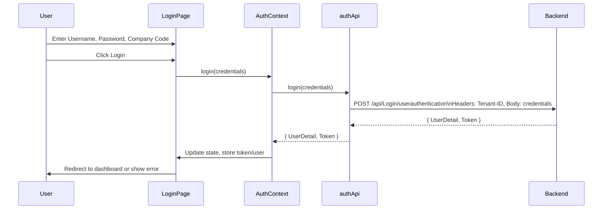

# Login Workflow Documentation

## 1. User Input (Login Form)
- **Fields:**
  - **Username** (`UserName`)
  - **Password** (`Password`)
  - **Company Code** (`companyCode`, numbers only)
- **Validation:**
  - All fields are required.
  - Company Code must be numeric.

## 2. Form Submission
- When the user submits the form:
  - The `handleSubmit` function is triggered.
  - It validates the input fields.
  - If validation passes, it calls the `login` function from the `useAuth` context, passing the credentials.

## 3. Auth Context (`useAuth`)
- The `login` function in `AuthContext`:
  - Calls `authApi.login(credentials)` (from `src/services/api.ts`).
  - Handles loading state and error propagation.

## 4. API Call (`authApi.login`)
- **Endpoint:**  
  `POST https://localhost/api/Login/userauthentication`
- **Request Body:**
  ```json
  {
    "UserName": "the_username",
    "Password": "the_password"
  }
  ```
- **Headers:**
  - `Content-Type: application/json`
  - `Tenant-ID: companyCode` (from the form)

- **Implementation:**
  - The `companyCode` is extracted from credentials and sent as the `Tenant-ID` header.
  - The rest of the credentials are sent as the request body.

## 5. API Response
- **Expected Response:**
  ```json
  {
    "UserDetail": {
      "Id": 1,
      "Username": "avash",
      "FullName": "Avash Shrestha",
      ... // other user fields
    },
    "Token": "jwt-token-string"
  }
  ```

## 6. Handling the Response
- On success:
  - The JWT `Token` is stored in localStorage (for future API calls).
  - The `UserDetail` object is also stored in localStorage.
  - The app state is updated with the user and token.
  - The user is redirected to the dashboard.
- On failure:
  - An error message is shown to the user (e.g., invalid credentials).

## 7. Subsequent API Requests
- The stored JWT token is automatically included as the `Authorization: Bearer <token>` header in all future API requests (handled by an Axios interceptor).

---

## Summary Diagram



---

**In summary:**
- User fills the form → credentials and company code are validated → API is called with company code as header → response is stored and user is logged in → token is used for all future requests.